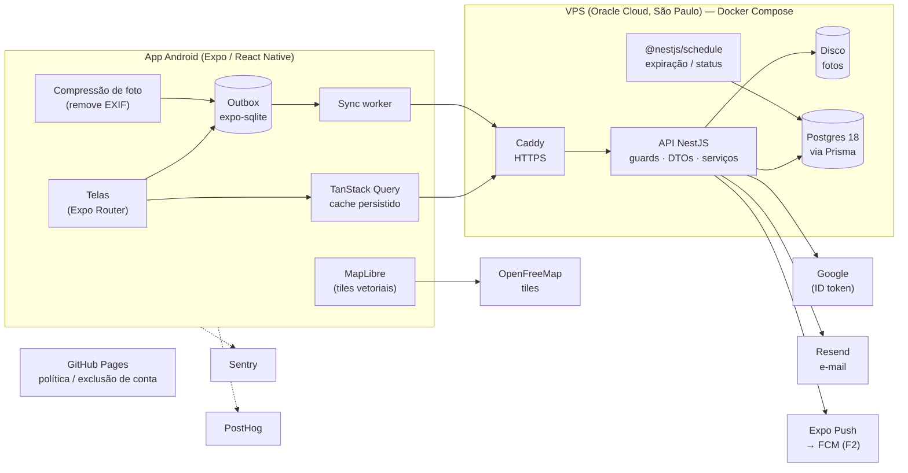
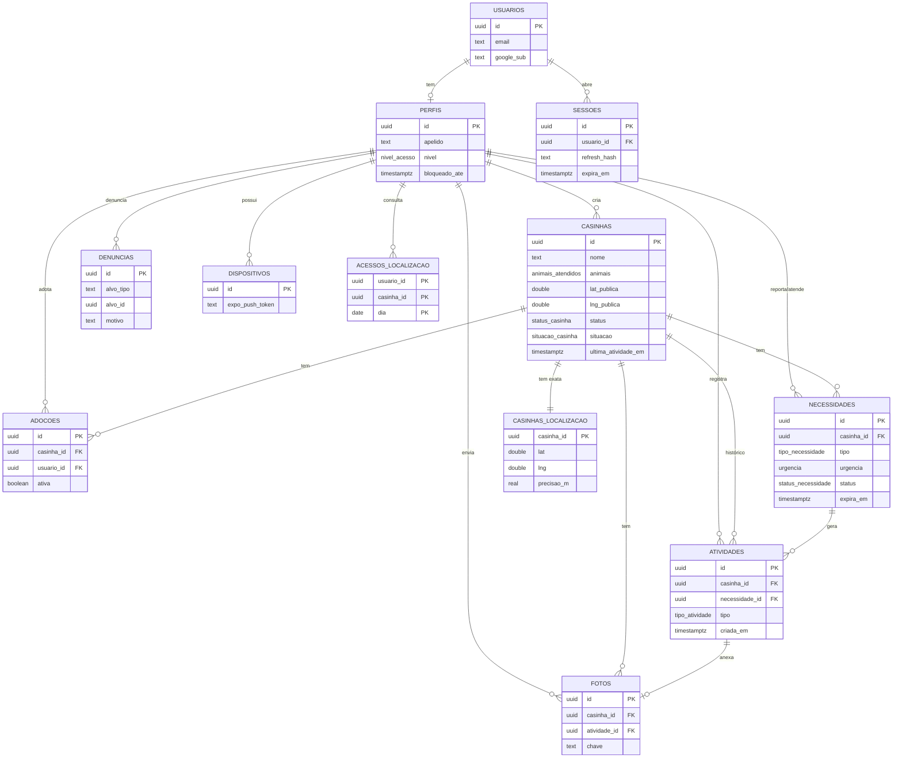
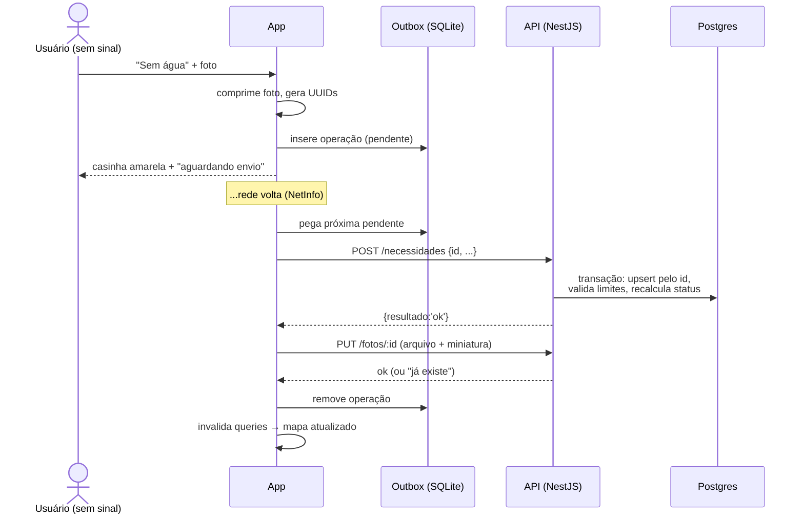

# 04 — Arquitetura

## Visão geral

Arquitetura **app + API própria + Postgres**. O app Expo nunca fala com o banco: tudo passa pela **API NestJS**, que concentra as regras de negócio, a autorização e a proteção da localização.

- **Leituras** sensíveis (mapa, detalhe) passam por endpoints que decidem, por usuário, se devolvem a localização exata ou a pública.
- **Toda escrita** passa por endpoints que validam o DTO, a permissão, os limites diários e as regras de negócio numa **transação** do Prisma. Escritas vindas do celular são **idempotentes** pelo UUID gerado no aparelho.
- **Tarefas por tempo** (expiração, status "sem notícias", limpeza de fotos) rodam no processo da API com `@nestjs/schedule`.
- **Fotos** ficam no disco do servidor, atrás de uma interface de armazenamento, e só são servidas por URL assinada.
- **Integrações** externas: Google (validação do ID token), Resend (e-mail), Expo Push (F2).



## Estrutura do repositório

Monorepo simples, sem ferramenta de monorepo:

```
rede-casinha/
├── app/                          # Projeto Expo (SDK 57)
│   ├── src/
│   │   ├── app/                  # Rotas (Expo Router): só telas e layouts
│   │   │   ├── _layout.tsx       # Stack raiz
│   │   │   ├── (tabs)/
│   │   │   │   ├── index.tsx     # Mapa
│   │   │   │   ├── minhas.tsx    # Minhas casinhas
│   │   │   │   └── perfil.tsx
│   │   │   ├── casinha/[id].tsx  # Detalhe
│   │   │   ├── casinha/nova.tsx  # Cadastro
│   │   │   ├── necessidade/nova.tsx
│   │   │   └── login.tsx
│   │   ├── api/                  # Cliente HTTP, tipos gerados do OpenAPI, hooks React Query
│   │   ├── offline/              # outbox.ts, sync-worker.ts, schema.sql
│   │   ├── map/                  # Camadas, estilos, clustering
│   │   ├── fotos/                # Compressão, upload
│   │   ├── domain/               # Tipos, regras puras (ex.: rótulos de status)
│   │   ├── components/           # Componentes de UI
│   │   ├── constants/            # Tema, espaçamentos
│   │   ├── hooks/
│   │   └── i18n/pt-BR.ts
│   ├── app.config.ts
│   └── eas.json
├── api/                          # API NestJS 12 (ESM, Node 24)
│   ├── prisma/
│   │   ├── schema.prisma         # Fonte da verdade do banco
│   │   ├── migrations/           # SQL versionado (inclui índices parciais manuais)
│   │   └── seed.ts
│   ├── src/
│   │   ├── main.ts               # Bootstrap + Swagger (fora de produção)
│   │   ├── configurar-app.ts     # Prefixo /v1, ValidationPipe, shutdown hooks (também usado nos e2e)
│   │   ├── config/ambiente.ts    # Variáveis de ambiente validadas com Zod
│   │   ├── app.module.ts
│   │   ├── comum/                # Guards, decorators (@Publico, @Nivel, @UsuarioAtual), filtros, geo.ts
│   │   ├── infra/                # prisma/, armazenamento/, email/
│   │   └── modulos/              # auth, me, casinhas, localizacao, necessidades, adocoes,
│   │                             # fotos, denuncias, admin, status, limites, saude
│   ├── prisma7.config.ts         # Config do CLI do Prisma
│   ├── test/                     # e2e (Vitest + supertest) contra rede_casinha_test
│   ├── bruno/                    # Coleção de requisições (inclui rotas /admin)
│   └── Dockerfile
├── docker/postgres/init/         # Scripts de inicialização do banco local
├── docker-compose.yml            # Postgres local
├── site/                         # GitHub Pages: privacidade, termos, excluir conta
└── docs/
```

## Módulos da API (NestJS)

| Módulo | Responsabilidade |
|---|---|
| `auth` | Login Google, código por e-mail, senha (revisor), emissão e rotação de tokens, logout |
| `me` | Perfil do usuário logado, conclusão de cadastro, exclusão de conta, "minhas casinhas" |
| `casinhas` | Cadastro, edição, busca por área, detalhe, check-in, pedido de desativação |
| `localizacao` | **Único** módulo que lê `casinhas_localizacao`: `podeVerExata`, geração da localização pública, validação de proximidade, auditoria de acessos |
| `necessidades` | Reportar, reconfirmar, atender, contestar |
| `adocoes` | Adotar e deixar de adotar |
| `fotos` | Upload idempotente, URL assinada, entrega do arquivo |
| `denuncias` | Denunciar, ocultação automática |
| `admin` | Rotas de moderação (`@Nivel('moderador')`) |
| `status` | `recalcularStatus` (RN01), prazos (RN02), jobs `@Cron` |
| `limites` | `consumirLimite` (RN06) |
| `saude` | `GET /saude` |
| `infra/prisma` | `PrismaService` global |
| `infra/armazenamento` | Interface `Armazenamento` com drivers `disco` (MVP) e `s3` (R2, futuro) |
| `infra/email` | Envio via Resend, templates em pt-BR |

**Peças transversais:**
- **Guard global de autenticação** (`@nestjs/jwt`): toda rota exige token, exceto as marcadas com `@Publico()`.
- **`NivelGuard`** + `@Nivel('verificado' | 'moderador' | 'admin')` para rotas restritas.
- **`ThrottlerGuard`** (`@nestjs/throttler`): limite por IP, mais rígido nas rotas `/auth`.
- **`ValidationPipe` global** (`whitelist`, `forbidNonWhitelisted`, `transform`): DTOs com `class-validator`.
- **Filtro de exceções** que traduz erros do Prisma (ex.: `P2002` → 409) e nunca devolve detalhes internos.
- **`@UsuarioAtual()`**: decorator que injeta `{ id, nivel }` do token no controller.

## Modelo de dados

Convenção do Prisma: modelos em PascalCase no singular (`Casinha`), mapeados para tabelas em snake_case no plural (`@@map("casinhas")`). Campos em camelCase no código e snake_case no banco (`@map`). A tabela abaixo usa os nomes do banco.

Índices únicos parciais são declarados no schema com a preview feature `partialIndexes` do Prisma 7. As restrições `CHECK` (faixa de coordenadas, contadores não negativos, adoção encerrada com data) estão escritas à mão na migration inicial; o Prisma não as modela nem as remove.

### Tipos enumerados

| Enum | Valores |
|---|---|
| `nivel_acesso` | `colaborador`, `verificado`, `moderador`, `admin` |
| `animais_atendidos` | `caes`, `gatos`, `ambos` |
| `status_casinha` | `ok`, `atencao`, `urgente`, `sem_noticias` |
| `situacao_casinha` | `ativa`, `em_revisao`, `inativa` |
| `tipo_necessidade` | `racao`, `agua`, `reforma`, `cobertas`, `limpeza`, `remedio_veterinario`, `outro` |
| `urgencia` | `normal`, `urgente` |
| `status_necessidade` | `aberta`, `atendida`, `expirada`, `cancelada` |
| `tipo_atividade` | `cadastro`, `reporte`, `reconfirmacao`, `atendimento`, `contestacao`, `check_in`, `edicao`, `adocao`, `fim_adocao`, `expiracao`, `desativacao_pedida`, `moderacao` |
| `status_moderacao` | `visivel`, `oculto_auto`, `oculto_moderador` |

### Entidades de conta

#### `usuarios`
| Campo | Tipo | Notas |
|---|---|---|
| `id` | uuid PK | |
| `email` | text unique | minúsculo |
| `google_sub` | text unique null | `sub` do ID token do Google |
| `senha_hash` | text null | `argon2`; só a conta de demonstração do revisor |
| `email_verificado_em` | timestamptz null | |
| `criado_em` | timestamptz | |

#### `sessoes`: refresh tokens
| Campo | Tipo | Notas |
|---|---|---|
| `id` | uuid PK | |
| `usuario_id` | uuid FK | `on delete cascade` |
| `refresh_hash` | text unique | SHA-256 do token opaco |
| `expira_em` | timestamptz | 60 dias |
| `revogada_em` | timestamptz null | |
| `substituida_por` | uuid null | rotação: reuso de um token já substituído revoga todas as sessões do usuário |
| `criada_em` | timestamptz | |

#### `codigos_email`
| Campo | Tipo | Notas |
|---|---|---|
| `id` | uuid PK | |
| `email` | text | índice |
| `codigo_hash` | text | |
| `expira_em` | timestamptz | +10 min |
| `tentativas` | int | máx. 5 |
| `usado_em` | timestamptz null | |

#### `perfis`: 1:1 com `usuarios`, criado ao concluir o cadastro
| Campo | Tipo | Notas |
|---|---|---|
| `id` | uuid PK | = `usuarios.id`, `on delete cascade` |
| `apelido` | varchar(30) | 3 a 30 caracteres, como digitado |
| `apelido_normalizado` | varchar(30) unique | minúsculas e sem acentos: "Márcia" e "marcia" colidem |
| `nivel` | nivel_acesso | padrão `colaborador` |
| `maior_de_idade_em` | timestamptz | quando declarou ter 18 anos ou mais |
| `termos_versao` | text | ex.: `2026-10-01` |
| `termos_aceitos_em` | timestamptz | |
| `bloqueado_ate` | timestamptz null | |
| `verificado_por` | uuid null FK perfis | quem promoveu |
| `criado_em` | timestamptz | |

### Entidades do domínio

#### `casinhas`: dados **públicos**
| Campo | Tipo | Notas |
|---|---|---|
| `id` | uuid PK | **gerado no celular** (idempotência offline) |
| `nome` | text | 3 a 60 caracteres |
| `descricao` | text null | até 500 caracteres |
| `animais` | animais_atendidos | |
| `lat_publica`, `lng_publica` | double precision | ponto deslocado 150–400 m; índice composto `(lat_publica, lng_publica)` |
| `uf` | char(2) null | preenchido em F2 (geocodificação reversa) |
| `municipio_ibge` | int null | F2/F3 |
| `status` | status_casinha | calculado (RN01) |
| `situacao` | situacao_casinha | padrão `ativa` |
| `ultima_atividade_em` | timestamptz | |
| `criada_por` | uuid FK perfis null | null se a conta foi excluída |
| `criada_em`, `atualizada_em` | timestamptz | |
| `moderacao` | status_moderacao | |
| `mesclada_em` | uuid null FK casinhas | destino da mescla |

#### `casinhas_localizacao`: dados **sensíveis**, 1:1 com casinhas
| Campo | Tipo | Notas |
|---|---|---|
| `casinha_id` | uuid PK FK casinhas | |
| `lat`, `lng` | double precision | exata; índice composto `(lat, lng)` |
| `precisao_m` | real | precisão do GPS no cadastro |
| `atualizada_em` | timestamptz | |

**Só o módulo `localizacao` da API acessa esta tabela.** A regra é aplicada por lint (`no-restricted-imports`/`no-restricted-syntax` para `prisma.casinhaLocalizacao` fora do módulo) e coberta por testes e2e.

#### `adocoes`
| Campo | Tipo | Notas |
|---|---|---|
| `id` | uuid PK | |
| `casinha_id` | uuid FK | |
| `usuario_id` | uuid FK perfis | |
| `ativa` | boolean | índice único parcial `(casinha_id, usuario_id) where ativa`; `CHECK (ativa OR encerrada_em IS NOT NULL)` |
| `iniciada_em`, `encerrada_em` | timestamptz | |

Regra: no máximo 3 `ativa = true` por casinha (verificado no serviço, dentro da transação).

#### `necessidades`
| Campo | Tipo | Notas |
|---|---|---|
| `id` | uuid PK | gerado no celular |
| `casinha_id` | uuid FK | |
| `tipo` | tipo_necessidade | |
| `urgencia` | urgencia | |
| `observacao` | text null | até 280 caracteres |
| `status` | status_necessidade | |
| `criada_por` | uuid FK null | |
| `criada_em` | timestamptz | horário do servidor |
| `criada_no_celular_em` | timestamptz | horário do celular (útil no offline) |
| `expira_em` | timestamptz | `criada_em + prazo(tipo)` (RN02) |
| `atendida_por` | uuid FK null | |
| `atendida_em` | timestamptz null | |
| `validado_local` | boolean null | **nunca exposto ao app** |

Índice único parcial `(casinha_id, tipo) where status = 'aberta'`, que garante a RN02.

#### `atividades`: histórico *append-only*
| Campo | Tipo | Notas |
|---|---|---|
| `id` | uuid PK | gerado no celular |
| `casinha_id` | uuid FK | |
| `necessidade_id` | uuid FK null | |
| `tipo` | tipo_atividade | |
| `usuario_id` | uuid FK null | |
| `observacao` | text null | |
| `criada_em` | timestamptz | servidor |
| `criada_no_celular_em` | timestamptz | celular |
| `validado_local` | boolean null | não exposto |

#### `fotos`
| Campo | Tipo | Notas |
|---|---|---|
| `id` | uuid PK | gerado no celular |
| `casinha_id` | uuid FK | |
| `atividade_id` | uuid FK null | null = foto de perfil da casinha |
| `chave` | text | `fotos/{casinha_id}/{id}.jpg` na interface de armazenamento |
| `chave_miniatura` | text | `fotos/{casinha_id}/{id}_t.jpg` |
| `enviada_por` | uuid FK null | |
| `criada_em` | timestamptz | |
| `expira_em` | timestamptz null | fotos de atendimento: +90 dias |
| `moderacao` | status_moderacao | |

#### `denuncias`
| Campo | Tipo | Notas |
|---|---|---|
| `id` | uuid PK | |
| `alvo_tipo` | enum `alvo_denuncia` | `casinha`, `foto`, `necessidade`, `perfil` |
| `alvo_id` | uuid | |
| `motivo` | enum `motivo_denuncia` | `falsa`, `duplicada`, `ofensiva`, `expoe_pessoa`, `perigo_animais`, `outro` |
| `descricao` | text null | |
| `denunciante_id` | uuid FK | único por `(alvo_id, denunciante_id)` |
| `status` | enum `status_denuncia` | `aberta`, `procedente`, `improcedente` |
| `resolvida_por`, `resolvida_em` | | |

#### `acoes_moderacao`: auditoria de moderação
`id`, `moderador_id`, `acao`, `alvo_tipo`, `alvo_id`, `motivo`, `criada_em`.

#### `acessos_localizacao`: auditoria
| Campo | Tipo | Notas |
|---|---|---|
| `usuario_id` | uuid | |
| `casinha_id` | uuid | |
| `dia` | date | PK composta `(usuario_id, casinha_id, dia)` |

É usada para aplicar o limite de 50 casinhas por dia por verificado e para investigar abusos. Retenção de 180 dias.

#### `limites_uso`: rate limit por regra de negócio
| Campo | Tipo |
|---|---|
| `usuario_id`, `acao`, `dia` | PK composta |
| `quantidade` | int |

#### `dispositivos` (F2)
`id`, `usuario_id`, `expo_push_token` (unique), `plataforma`, `criado_em`, `ultimo_uso_em`.

### Diagrama ER



## Geo sem PostGIS (`api/src/comum/geo.ts`)

Funções puras, com testes unitários:

```ts
const RAIO_TERRA_M = 6_371_000;

/** Distância em metros entre dois pontos (haversine). */
export function distanciaM(a: Ponto, b: Ponto): number { /* ... */ }

/** Ponto de destino a partir de uma origem, distância (m) e azimute (graus). */
export function destino(origem: Ponto, distanciaM: number, azimuteGraus: number): Ponto { /* ... */ }

/** Caixa (lat/lng) que contém um círculo de raio `raioM`: pré-filtro para usar o índice. */
export function caixaAoRedor(centro: Ponto, raioM: number): Caixa { /* ... */ }
```

- **Busca por área do mapa:** `WHERE lat_publica BETWEEN :minLat AND :maxLat AND lng_publica BETWEEN :minLng AND :maxLng` (índice composto).
- **"Tem casinha a até 30 m?" e "está a até 100 m?":** `caixaAoRedor` filtra no banco (índice) e `distanciaM` confirma em TypeScript.

### Localização pública: como é gerada

Executado **uma vez**, dentro da transação de criação da casinha (e de novo só se a exata mudar mais de 30 m):

```ts
// distância entre 150 e 400 m, direção aleatória (crypto.randomInt)
const publica = destino(exata, 150 + aleatorio() * 250, aleatorio() * 360);
```

O app desenha um círculo de **500 m** em volta da localização pública. Como o deslocamento máximo é de 400 m, a casinha real sempre fica dentro do círculo.

## Endpoints

Todos sob `https://<dominio>/v1`, exceto `GET /saude` (na raiz, para o monitoramento). OpenAPI em `/docs` (só fora de produção) (gerado pelo `@nestjs/swagger`), de onde o app gera seus tipos (`npm run gen:api`). Escritas vindas do celular são **idempotentes**: o corpo traz o `id` (ou `atividadeId`) gerado no aparelho, e repetir a chamada devolve o mesmo resultado sem duplicar.

### Autenticação (`@Publico()`, com throttling rígido)
| Método e rota | Corpo | Efeito |
|---|---|---|
| `POST /auth/google` | `{ idToken }` | Valida o ID token (audience = cliente Web), cria ou encontra o usuário, devolve `{ acesso, refresh, precisaCadastro }` |
| `POST /auth/codigo` | `{ email }` | Gera e envia o código de 6 dígitos (resposta sempre igual, exista ou não a conta) |
| `POST /auth/codigo/verificar` | `{ email, codigo }` | Valida (10 min, 5 tentativas) e devolve os tokens |
| `POST /auth/senha` | `{ email, senha }` | Só para a conta de demonstração do revisor |
| `POST /auth/renovar` | `{ refresh }` | Rotaciona o refresh; reuso de um token antigo revoga todas as sessões |
| `POST /auth/sair` | `{ refresh }` | Revoga a sessão |

### Leitura
| Método e rota | Acesso | Retorno | Regras |
|---|---|---|---|
| `GET /casinhas?minLat&minLng&maxLat&maxLng` | logado | `{ casinhas: [{ id, nome, status, animais, lat, lng, exata, necessidadesAbertas[] }], truncado }` | Filtra pela coordenada **pública**. Máx. 1.000 itens (`truncado = true` se havia mais). Exata para criador, adotante e moderador; o verificado vê na lista **só** as que já abriu hoje no detalhe (a lista não gasta cota). Não traz inativas nem ocultadas. Coordenadas com 6 casas. ~200 bytes por casinha sem compressão. |
| `GET /casinhas/:id` | logado | casinha + necessidades abertas + adotantes (apelidos) + 30 últimas atividades (`apelido: null` = usuário removido) + `minhasPermissoes`. Fotos entram na T1.5. | Para o verificado, devolver a exata gasta 1 das 50 casinhas distintas do dia e registra em `acessos_localizacao`. Ocultada: só moderador, criador e adotantes; inativa: só moderador; senão 404. |
| `GET /me` | logado | perfil + contagens | |
| `GET /me/casinhas` | logado | casinhas que criei ou adotei: mesmos campos do mapa + `souCriador`, `souAdotante` | Sempre com a exata. Inclui as ocultadas por denúncia; não inclui as inativas. |
| `GET /fotos/:id?v=miniatura&exp&assinatura` | URL assinada | arquivo JPEG | Assinatura HMAC com validade de 1 h; `Cache-Control: private`. |
| `GET /saude` | público | `{ ok, banco }` | Fora do prefixo `/v1`. 503 se o banco estiver fora. |

### Escrita (exigem login, perfil não bloqueado e os limites da RN06)

Reportar, reconfirmar, atender, contestar e check-in (módulo `necessidades`) respondem `{ resultado, necessidadeId, status }` e travam a linha da casinha durante a transação. Reenviar o mesmo id devolve 200 sem repetir o efeito. Erros de regra são 4xx (`limite_diario` é 403, não 429), para a fila do celular não insistir.
| Método e rota | Corpo | Efeito |
|---|---|---|
| `POST /me/cadastro` | `{ apelido, maiorDeIdade, termosVersao }` | Cria o `perfis`. |
| `DELETE /me` | — | RN07: anonimiza contribuições, apaga fotos, perfil, sessões, dispositivos e o usuário. |
| `POST /casinhas` | `{ id, nome, descricao, animais, lat, lng, precisaoM, forcar, criadaNoCelularEm }` | Recusa se `precisaoM > 30` sem ajuste manual. Procura duplicatas a até 30 m: se houver e `forcar = false`, devolve `{ resultado: 'possivel_duplicata', candidatos: [{ id, nome, miniatura }] }` sem coordenadas. Se não, cria `casinhas` + `casinhas_localizacao` + atividade `cadastro` + adoção do criador. |
| `PATCH /casinhas/:id` | `{ nome?, descricao?, animais?, lat?, lng? }` | Só criador, adotante ou moderador. Mudança de localização limitada a 30 m (exceto moderador). |
| `POST /casinhas/:id/check-in` | `{ atividadeId, lat?, lng?, criadaNoCelularEm? }` | Atualiza `ultima_atividade_em` e recalcula o status. |
| `POST /casinhas/:id/desativacao` | `{ atividadeId, motivo }` | Atividade + entrada na fila de moderação. |
| `POST /casinhas/:id/adocao` | `{ lat, lng }` | Permitido ao criador, ou a quem está ≤ 100 m da exata. Resposta só `ok` ou `nao_permitido`, **sem distância**. Máx. 3 adotantes. |
| `DELETE /casinhas/:id/adocao` | — | Encerra a adoção. |
| `POST /necessidades` | `{ id, casinhaId, tipo, urgencia, observacao?, lat?, lng?, criadaNoCelularEm }` | Se já existe aberta do mesmo tipo: reconfirma (e sobe a urgência se for o caso). Calcula `validado_local` (≤ 100 m) e descarta as coordenadas do usuário. Recalcula o status. |
| `POST /necessidades/:id/reconfirmar` | `{ atividadeId, lat?, lng? }` | Renova `expira_em`. 1 vez a cada 12 h por usuário (antes disso devolve `ja_reconfirmada`, sem erro). Necessidade fechada: 409. |
| `POST /necessidades/:id/atender` | `{ atividadeId, observacao?, lat?, lng? }` | `status = atendida`. Se já estava atendida, só registra a atividade e devolve `{ resultado: 'ja_atendida' }`. |
| `POST /necessidades/:id/contestar` | `{ atividadeId, observacao }` | Só até 24 h depois do atendimento (senão 409 `fora_do_prazo`). Reabre a necessidade, a menos que já exista outra aberta do mesmo tipo. |
| `PUT /fotos/:id` | multipart: `arquivo`, `miniatura`, `casinhaId`, `atividadeId?` | Idempotente pelo `id`. Máx. 1 MB, só `image/jpeg`, limite por casinha. Grava pela interface de armazenamento e registra em `fotos`. |
| `POST /denuncias` | `{ alvoTipo, alvoId, motivo, descricao? }` | Com 3 denúncias distintas de contas com ≥ 7 dias: `moderacao = oculto_auto`. |

### Moderação (`@Nivel('moderador')`; usadas pelo Bruno no MVP)
| Método e rota | Efeito |
|---|---|
| `GET /admin/fila` | Denúncias abertas + casinhas `em_revisao` + pedidos de desativação + pares de casinhas a menos de 30 m |
| `POST /admin/ocultar` · `POST /admin/restaurar` | `{ alvoTipo, alvoId, motivo }` |
| `POST /admin/casinhas/:id/desativar` | Desativa |
| `POST /admin/casinhas/:id/mesclar` | `{ destinoId }`: move atividades, fotos e adotantes; desativa a origem |
| `POST /admin/usuarios/:id/nivel` | `{ nivel }` (promover a verificado exige moderador; a moderador, admin) |
| `POST /admin/usuarios/:id/bloqueio` | `{ ate, motivo }` |
| `POST /admin/denuncias/:id/resolver` | `{ procedente }` |

Toda ação grava em `acoes_moderacao`.

## Fotos (armazenamento)

- **Interface** `Armazenamento`: `salvar(chave, buffer)`, `ler(chave)`, `apagar(chave)`, `existe(chave)`.
- **Driver `disco` (MVP):** grava em `/dados/fotos` (volume Docker incluído no backup). A API entrega o arquivo em `GET /fotos/:id` só com URL assinada (HMAC-SHA256 de `id + variante + exp` com um segredo do `.env`).
- **Driver `s3` (futuro, R2):** mesma interface; a URL assinada passa a ser a pré-assinada do R2 (T2.14).
- O upload valida tamanho, MIME e os *magic bytes* do JPEG antes de gravar.

## Jobs (`@nestjs/schedule`)

Todos idempotentes: rodar duas vezes não causa efeito extra.

| Job | Frequência | Faz |
|---|---|---|
| `expirar-necessidades` | a cada 15 min | `aberta` com `expira_em < agora` → `expirada` + atividade `expiracao` + recálculo do status. |
| `recalcular-status` | a cada hora | Recalcula o status das casinhas afetadas por tempo (48 h de água/ração, 7 dias sem notícias). |
| `limpar-fotos-expiradas` | diário, 3h | Apaga do armazenamento e do banco as fotos com `expira_em` vencido. |
| `limpar-auditoria` | semanal | Apaga `acessos_localizacao` com mais de 180 dias, `limites_uso` com mais de 7 dias, `codigos_email` usados ou vencidos e sessões expiradas. |

Na Fase 2 entra o **pg-boss** para trabalhos com retentativa (push). O relógio é injetável (`Relogio.agora()`) para testar as transições por tempo.

## Offline: fila de saída (outbox)

### Tabela local (expo-sqlite)
```sql
create table outbox (
  id text primary key,          -- = id / atividadeId enviado à API
  usuario_id text not null,     -- dono: só é enviada com a sessão dele
  operacao text not null,       -- 'criar_casinha' | 'reportar_necessidade' | ...
  metodo text not null,         -- 'POST' | 'PUT' | ...
  caminho text not null,        -- ex.: /casinhas/<id>/check-in
  payload text not null,        -- JSON com o corpo da requisição
  fotos text,                   -- JSON: [{id, uri_local, uri_miniatura}]
  status text not null,         -- 'pendente' | 'enviando' | 'erro_permanente'
  tentativas integer default 0,
  proxima_tentativa_em integer, -- epoch ms (backoff exponencial, máx. 30 min)
  ultimo_erro text,
  criado_em integer not null
);
```

### Regras do sync worker
1. Dispara quando: uma operação entra na fila, a rede volta (NetInfo), o app volta ao primeiro plano, e a cada 2 min enquanto o app está aberto e há pendências.
2. Processa **em ordem de criação**, uma por vez. Uma casinha criada offline precisa existir antes dos reportes nela. Um erro temporário para a fila inteira (não pula o item da frente); um erro permanente tira o item da frente e a fila segue.
3. Para cada item: (a) chama o endpoint da operação; (b) sobe as fotos com `PUT /fotos/:id` (idempotente); (c) remove da fila.
4. Erro de rede ou 5xx: backoff. Erro de regra (4xx: limite, sem permissão, casinha inativa): `erro_permanente`, avisa o usuário e envia ao Sentry. 401: renova o token e tenta de novo.
5. As fotos pendentes ficam copiadas em `FileSystem.documentDirectory` (não em cache, que o sistema pode apagar).
6. **UI otimista:** a ação aparece na hora na tela, com o selo "aguardando envio", via `queryClient.setQueryData`. Depois do sync, as queries são invalidadas.
7. Um contador "N ações aguardando envio" fica visível no topo do mapa.
8. A rede voltar e o app voltar ao primeiro plano ignoram a espera do backoff (as condições mudaram); o intervalo de 2 min a respeita.



### Leitura offline
- O TanStack Query persiste no MMKV as respostas de `GET /casinhas` (área arredondada a uma grade de ~2 km para reaproveitar cache), `GET /casinhas/:id` e `GET /me/casinhas`, com `gcTime` de 7 dias. Ao sair da conta, o cache em memória e o persistido são apagados (podem conter exatas que só o usuário anterior via).
- Os tiles do mapa ficam no cache automático do MapLibre (*ambient cache*). O download explícito do bairro fica para a F2.

## Segurança: resumo

- O app só conhece a URL da API. **Nenhum segredo no app.**
- **Guard global:** toda rota exige token, exceto as marcadas com `@Publico()` (só auth e `/saude`; nenhuma leitura de casinha, ver [D01](01-visao-geral.md#d01--mapa-só-com-login-2026-09-25)). Um teste e2e lista as rotas públicas e falha se aparecer uma nova sem revisão.
- **DTOs validados** em toda entrada (`whitelist` + `forbidNonWhitelisted`): campos extras são rejeitados.
- **Localização exata** só sai pelo módulo `localizacao`. Nenhum endpoint devolve a distância entre o usuário e a casinha. Testes e2e para cada nível de acesso.
- **Tokens:** acesso de 15 min; refresh opaco, rotativo e com hash no banco; códigos por e-mail com hash, validade e limite de tentativas.
- **HTTP:** `helmet`, CORS fechado, HTTPS pelo Caddy, throttling por IP.
- **Servidor:** Postgres sem porta pública; segredos só no `.env` do servidor (permissão 600); SSH só com chave; firewall liberando 22, 80 e 443.
- **Logs** sem e-mail, token ou coordenadas.

## Ambientes

| Ambiente | Onde | Uso |
|---|---|---|
| Local | `docker compose up -d` (Postgres na 5433) + `npm run start:dev` em `api/` (porta 3000) + dev build no celular | Desenvolvimento diário. No celular via adb: `adb reverse tcp:3000 tcp:3000` e `adb reverse tcp:8081 tcp:8081`. |
| Testes | Banco `rede_casinha_test` (local e no CI via *service container*) | e2e |
| Produção | VPS Oracle Cloud (São Paulo): `docker-compose.prod.yml` com API + Postgres + Caddy | Testadores e usuários |

O app lê a URL da API de `EXPO_PUBLIC_API_URL` (`http://localhost:3000/v1` em desenvolvimento). Em produção, as migrations rodam com `prisma migrate deploy` antes de a nova versão da API subir.
