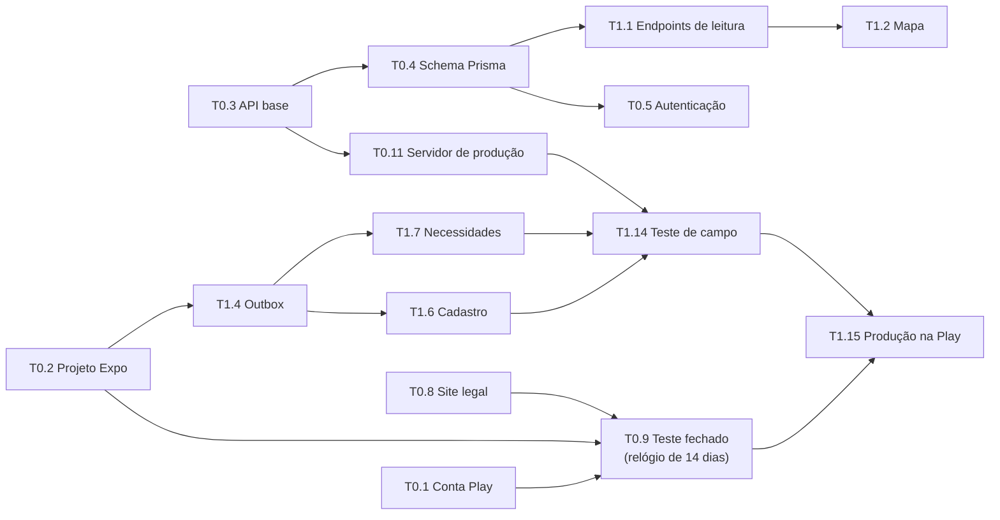

# 05 — Plano de desenvolvimento

## Convenções

- **Esforço:** **P** = até 1 dia · **M** = 1 a 2 dias · **G** = 3 a 4 dias (1 dev em tempo integral).
- **Prioridade:** **alta** = bloqueia o MVP · **média** = MVP melhor, mas dá para adiar · **baixa** = pode esperar.
- **Depende de:** IDs das tasks que precisam estar prontas antes.
- Estimativa total do **MVP (Fase 0 + Fase 1): ~7 a 9 semanas em tempo integral** (o dobro em meio período). Veja o [corte de emergência](#corte-de-emergência-do-mvp) para chegar em ~6 semanas.

## Stack do backend (decidida em 24/09/2026)

O backend é uma **API própria**. Padrões adotados (dá para trocar qualquer um antes da T0.3):

| Camada | Escolha |
|---|---|
| API | **Node 24** + TypeScript (ESM) + **NestJS 12** (plataforma Express) + `class-validator` (DTOs) + `@nestjs/swagger` (OpenAPI) — pasta `api/` |
| Banco | **Postgres 18** (sem PostGIS) + **Prisma** (schema, migrations, client) |
| Geo | Colunas `lat`/`lng` com índice; busca por área com `BETWEEN`; distância por haversine; deslocamento da localização pública calculado na API |
| Autenticação | Própria com `@nestjs/jwt` e guard global: JWT de acesso (15 min) + refresh token rotativo (hash no banco); Google via verificação do ID token; código de 6 dígitos por e-mail (Resend); e-mail + senha só para a conta do revisor da loja |
| Autorização | Guards do Nest (`@Publico()`, `@Nivel()`) + regras na camada de serviço, cobertas por testes e2e |
| Fotos | Interface de armazenamento: disco da VPS no MVP, driver S3 (Cloudflare R2) quando precisar; acesso por URL assinada com validade curta |
| Tarefas agendadas | **@nestjs/schedule** (`@Cron`) no MVP; **pg-boss** (fila no próprio Postgres, com retentativas) para push na Fase 2 |
| Testes | **Vitest** + `@nestjs/testing` + `supertest` (unitários + e2e contra o banco `rede_casinha_test`) |
| Lint | **oxlint** + Prettier (padrão do Nest 12) |
| Contrato app ↔ API | OpenAPI gerado pela API → tipos TS no app (`openapi-typescript`) |
| Produção | VPS com Docker Compose (API + Postgres + Caddy com HTTPS automático) |

## Caminho crítico

O **teste fechado de 14 dias com 12 testadores** é exigido de contas pessoais novas na Google Play e roda **em paralelo** ao desenvolvimento. Se ele começar tarde, o lançamento atrasa 2 semanas mesmo com o código pronto.

---

## Fase 0 — Setup e fundação (~2 a 3 semanas)

- [ ] **T0.1 — Criar conta de desenvolvedor Google Play**
  - Prioridade: **alta** · Esforço: **P** · Depende de: —
  - Pronto quando: a conta está verificada (identidade aprovada), a taxa de US$ 25 foi paga e o app foi criado no Console com o nome de pacote definitivo.
  - [ ] Criar um e-mail dedicado ao projeto (ex.: `redecasinha.app@gmail.com`). Ele aparece publicamente na loja.
  - [ ] Criar conta **pessoal** no Play Console, pagar a taxa e enviar o documento para verificação.
  - [ ] Definir o nome do pacote: `br.app.redecasinha` (não muda nunca mais).
  - [ ] Criar o app no Console (nome, idioma pt-BR, gratuito).

- [x] **T0.2 — Criar repositório e projeto Expo**
  - Prioridade: **alta** · Esforço: **P** · Depende de: —
  - Pronto quando: o dev build roda num Android físico, com hot reload, lint e typecheck passando.
  - [x] `git init`, repositório no GitHub (privado por enquanto) e `.gitignore` com `.env*`.
  - [x] `npx create-expo-app@latest app` com TypeScript e Expo Router. (Expo SDK 57; rotas em `app/src/app/`.)
  - [x] Instalar `expo-dev-client`, configurar `app.config.ts` (nome, `android.package`, ícone provisório) e `eas.json` (perfis `development`, `preview`, `production`). (Variantes `br.app.redecasinha` e `.dev`.)
  - [x] ESLint + Prettier + `tsc --noEmit` num script `npm run check`. (`expo-doctor`: 18/18 ok.)
  - [x] Gerar o dev build (`eas build -p android --profile development` ou `--local`) e instalar no celular. (Build local econômico com `npm run android:apk`; instalado e rodando num Redmi Note 13 / Android 15 pelo cabo, com Fast Refresh verificado.)
  - [x] Estrutura de pastas de [04-arquitetura.md](04-arquitetura.md#estrutura-do-repositório).
  - Conexão pelo cabo no WSL: `npm run android:instalar` + `npm run celular` (usa o adb do Windows e uma ponte para o Metro/API; detalhes em `app/README.md`). EAS no futuro: `eas login` + `eas init` e copiar `owner` e `extra.eas.projectId` para o `app.config.ts`.

- [x] **T0.3 — Banco local e API base (NestJS + Prisma)**
  - Prioridade: **alta** · Esforço: **M** · Depende de: —
  - Pronto quando: `docker compose up -d` + `npm run start:dev` na pasta `api/` sobem a API; `GET /saude` responde `{ ok: true, banco: "ok" }`; `npm run check` e `npm test` passam; a documentação OpenAPI abre em `/docs`.
  - [x] Postgres 18 local via `docker-compose.yml` (porta 5433, bancos `rede_casinha` e `rede_casinha_test`) + `.env.example`.
  - [x] Documentar num `README` como subir o ambiente local.
  - [x] Criar `api/` com o Nest CLI (`nest new api`, strict) + `@nestjs/swagger` com o plugin do CLI (OpenAPI em `/docs`) + `ValidationPipe` global (`whitelist`, `forbidNonWhitelisted`, `transform`). (NestJS 12 em **ESM**, Node 24 via `.nvmrc`; rotas de negócio sob `/v1`; `/docs` só fora de produção.)
  - [x] Prisma: `prisma init`, `DATABASE_URL` vindo do `.env`, `PrismaModule` global com um `PrismaService` (conecta no `onModuleInit`). (Prisma 7.10 com `@prisma/adapter-pg`; config em `prisma7.config.ts`; client em `src/generated/prisma`.)
  - [x] `@nestjs/config` com validação das variáveis de ambiente na inicialização (a API não sobe com configuração faltando). (Esquema Zod em `src/config/ambiente.ts`.)
  - [x] `SaudeModule` com `GET /saude` (checa o banco com `SELECT 1`; 503 se o banco estiver fora).
  - [x] Estrutura por módulo do Nest: `src/modulos/<modulo>/` (`*.module.ts`, `*.controller.ts`, `*.service.ts`, `dto/`) + `src/infra/` (prisma, armazenamento, e-mail). (Hoje existem `infra/prisma` e `modulos/saude`; armazenamento e e-mail entram na T1.5 e na T0.5.) **Atualizado pela D02:** cada módulo agora tem `domain/`, `application/` e `infra/`, e o compartilhado fica em `src/shared/` ([04-arquitetura.md](04-arquitetura.md#camadas-de-um-módulo)).
  - [x] Lint + Prettier + `tsc --noEmit` em `npm run check`; testes unitários em `npm test` e e2e (supertest) com o banco `rede_casinha_test` em `npm run test:e2e`. (Seguindo o padrão do Nest 12: **oxlint** no lugar do ESLint e **Vitest** no lugar do Jest.)
  - [x] `Dockerfile` da API (multi-stage) para usar na T0.11. (Roda `prisma migrate deploy` antes de subir; healthcheck em `/saude`; ~560 MB, o peso vem do CLI do Prisma.)

- [x] **T0.4 — Schema Prisma, migrations e seed**
  - Prioridade: **alta** · Esforço: **M** · Depende de: T0.3
  - Pronto quando: `prisma migrate dev` cria todas as tabelas e enums do MVP do zero; o seed popula o banco local; os testes e2e limpam o banco de testes a cada suíte.
  - [x] `schema.prisma` com os enums e modelos: `Usuario`, `Perfil`, `Sessao` (refresh tokens), `CodigoEmail`, `Casinha`, `CasinhaLocalizacao`, `Adocao`, `Necessidade`, `Atividade`, `Foto`, `Denuncia`, `AcaoModeracao`, `AcessoLocalizacao`, `LimiteUso` (ver [04-arquitetura.md](04-arquitetura.md#modelo-de-dados)).
  - [x] Coordenadas como `Float` (`lat`/`lng`): pública em `Casinha`, exata em `CasinhaLocalizacao` (tabela separada); índice composto `(lat, lng)` em ambas. (+ `CHECK` de faixa válida escrito à mão na migration inicial.)
  - [x] Índices únicos parciais (necessidade `aberta` por tipo e casinha; adoção `ativa` por usuário e casinha). (Declarados no próprio schema com a preview feature `partialIndexes` do Prisma 7, o que evita o Prisma derrubá-los em migrations futuras. Verificado: nenhuma divergência entre schema e banco.)
  - [x] Regra de arquitetura: só o módulo `localizacao` lê `CasinhaLocalizacao` (protege a localização exata). (Teste `src/arquitetura.spec.ts`; confirmado que ele falha com uma violação.)
  - [x] `prisma/seed.ts` com ~30 casinhas falsas em volta da sua cidade. (5 usuários + 30 casinhas determinísticas; centro configurável por `SEED_LAT`/`SEED_LNG`, padrão Praça da Sé/SP.)
  - [x] Helper de testes e2e: migrations aplicadas no banco de testes + limpeza por suíte + fábricas de dados (`criarUsuario`, `criarCasinha`). (Usa `prisma migrate deploy` + `TRUNCATE`: o Prisma 7 bloqueia `migrate reset` executado por agente de IA sem consentimento. Recriação completa: `npm run db:reset:test`.)

- [ ] **T0.5 — Autenticação (API + app)**
  - Prioridade: **alta** · Esforço: **G** · Depende de: T0.2, T0.4
  - Pronto quando: dá para entrar com Google e com código por e-mail num aparelho real; o primeiro login leva à tela de apelido + 18 anos + termos; a sessão persiste depois de fechar o app e é renovada sozinha; os testes e2e cobrem código expirado, código errado 5 vezes e refresh token reutilizado.
  - [x] Criar o cliente OAuth Android (SHA-1 do keystore de debug **e** do Play App Signing) e o cliente Web no Google Cloud. (Web + Android `.dev` criados; o Android de produção só depois do 1º upload na Play (T0.9). IDs em `app/README.md`.)
  - [x] API `POST /auth/google`: verifica o ID token com `google-auth-library` (audience = cliente Web) e cria ou encontra o usuário.
  - [x] API `POST /auth/codigo` e `POST /auth/codigo/verificar`: código de 6 dígitos, guardado com hash, válido por 10 min, máximo de 5 tentativas; envio pelo **Resend** com template em pt-BR. (HMAC com segredo próprio; 1 código por minuto e 5 por hora por e-mail. Drivers de e-mail: `console` em desenvolvimento, `memoria` nos testes, `resend` em produção. O driver Resend **ainda não foi testado com envio real**: falta criar a conta e a `RESEND_API_KEY`.)
  - [x] API `POST /auth/senha`: e-mail + senha (hash `argon2`), só para a conta de demonstração do revisor. (Conta criada por `npm run conta:revisor`.)
  - [x] Guard global de autenticação (`@nestjs/jwt`) com o decorator `@Publico()` para rotas abertas e `@Nivel('moderador')` para rotas restritas. (Um guard só — `AcessoGuard` — autentica e confere nível; `@Nivel` também barra cadastro pendente e conta bloqueada.)
  - [x] Sessões: JWT de acesso (15 min) + refresh token opaco e rotativo (`POST /auth/renovar`), com hash no banco; reuso de um refresh antigo derruba todas as sessões do usuário. `POST /auth/sair` revoga a sessão.
  - [x] Rate limit por IP e por e-mail nas rotas de auth (`@nestjs/throttler`). (120/min geral e 10/min nas rotas `/auth`, verificado manualmente; desligado nos testes. Em produção, `CONFIAR_PROXY=true` atrás do Caddy.)
  - [x] App: `@react-native-google-signin/google-signin`; telas de e-mail e de código; tokens no `expo-secure-store`; cliente HTTP que renova o token sozinho ao receber 401. (Uma renovação por vez; sem internet, o app mantém a sessão e o último perfil salvo. Typecheck/lint ok; **não testado em aparelho**.)
  - [x] API `POST /me/cadastro` (DTO com class-validator) + tela de apelido, checkbox de 18 anos e aceite de termos com link. (No app, a validação usa a mesma regex da API, sem zod; o link dos termos aparece quando `EXPO_PUBLIC_SITE_URL` existir — T0.8.)
  - [x] Guarda de rotas: ~~visitante vê o mapa; ações de escrita abrem a tela "Entre para ajudar"~~ → **todo o app exige login** ([D01](01-visao-geral.md#d01--mapa-só-com-login-2026-09-25)). (`Stack.Protected` por estado da sessão: sem sessão só a tela de entrada, cadastro pendente só a de cadastro, logado as abas. `useExigirLogin()` removido.)
  - **Pendente para concluir:** testar o login com Google num aparelho real (o login por código + cadastro já passou no aparelho em 25/09/2026, com `EMAIL_DRIVER=console`); e criar a conta no Resend para envio real de e-mails (`EMAIL_DRIVER=resend`).

- [x] **T0.6 — Mapa base**
  - Prioridade: **alta** · Esforço: **M** · Depende de: T0.2
  - Pronto quando: o mapa do OpenFreeMap renderiza fluido num Android de entrada, centraliza na localização do usuário (com permissão) e cai para a última região salva (sem permissão).
  - [x] Instalar `@maplibre/maplibre-react-native` + config plugin e refazer o dev build. (MapLibre RN 11 — API nova: `Map`, `Camera` com `initialViewState`, `NativeUserLocation`. `prebuild --clean` + `npm run android:apk` compilando.)
  - [x] Estilo `https://tiles.openfreemap.org/styles/liberty` (ou `positron`, mais limpo), com a URL centralizada em uma constante. (`liberty` em `src/map/estilo.ts`, junto com a região padrão e os zooms.)
  - [x] `expo-location`: pedir permissão **só ao tocar em "minha localização"** ou no primeiro uso, com explicação antes do diálogo do sistema. (Explicação num `Alert` antes do diálogo; no primeiro uso pergunta uma vez só, depois só pelo botão; negada de vez → oferece abrir as configurações. Com permissão, abre na posição recente do sistema e refina com o GPS, sem puxar a câmera se a pessoa já mexeu no mapa.)
  - [x] Salvar a última câmera (centro e zoom) no MMKV. (`react-native-mmkv` 4 em `src/offline/armazenamento-rapido.ts`, instância que o cache do TanStack Query vai reaproveitar.)
  - [x] Atribuição OpenStreetMap/OpenFreeMap visível (obrigatória pela licença). (Texto fixo no canto do mapa; tocar abre os créditos completos do estilo. Logo e botão "i" nativos desligados.)
  - [x] Validado em aparelho real (Redmi Note 13, Snapdragon 685, Android 15) em 25/09/2026: 60 fps estáveis ao arrastar e dar zoom (0 quadros acima de 33 ms, medido no SurfaceFlinger); no primeiro uso abre na região padrão, explica e só então mostra o diálogo do sistema; com permissão centraliza no usuário (zoom 15); sem permissão reabre exatamente na última região, sem perguntar de novo; negada → alerta com "Abrir configurações", que leva à tela do app; liberada de novo → o botão centraliza. Créditos do mapa abrem ao tocar na atribuição.

- [ ] **T0.7 — Monitoramento de erros e analytics**
  - Prioridade: **média** · Esforço: **P** · Depende de: T0.2
  - Pronto quando: um erro de teste aparece no Sentry com o source map correto; um evento de teste aparece no PostHog; nenhum e-mail ou coordenada aparece nos payloads.
  - [ ] `@sentry/react-native` + plugin Expo + upload de source maps no EAS.
  - [ ] `beforeSend` que remove e-mail e arredonda ou remove lat/lng.
  - [ ] `posthog-react-native` com autocapture e replay desligados; wrapper `track(evento, props)` com lista fechada de eventos.

- [ ] **T0.8 — Site legal (GitHub Pages)**
  - Prioridade: **alta** · Esforço: **P** · Depende de: —
  - Pronto quando: três URLs públicas funcionando (política de privacidade, termos de uso, exclusão de conta), escritas em pt-BR e revisadas contra o checklist de [06-riscos.md](06-riscos.md#1-lgpd-e-privacidade).
  - [ ] Pasta `site/` com HTML ou Markdown simples publicado no GitHub Pages.
  - [ ] Política de privacidade: controlador (você), dados coletados, finalidades, bases legais, operadores (provedor da VPS, Resend, Sentry, PostHog, Google), transferência internacional, retenção, direitos do titular, canal de contato.
  - [ ] Termos de uso: 18+, conteúdo proibido, uso responsável da localização, moderação, isenção sobre a instalação física de casinhas.
  - [ ] Página "Excluir minha conta": instruções in-app + formulário (e-mail → código → confirmação), que chama a API (`DELETE /me`, T1.11). No começo pode ser um e-mail de contato atendido manualmente em até 7 dias.

- [ ] **T0.9 — Primeiro build no teste fechado + recrutar testadores**
  - Prioridade: **alta** · Esforço: **P** · Depende de: T0.1, T0.2, T0.8
  - Pronto quando: **≥ 12 testadores (meta de 20) inscritos** no teste fechado com o app instalado. A data de início dos 14 dias está anotada.
  - [ ] Build `preview`/`production` (AAB) via EAS e upload na trilha **Teste fechado**.
  - [ ] Preencher o mínimo para liberar o teste: política de privacidade, classificação indicativa, público-alvo (18+), questionário de segurança de dados (versão preliminar).
  - [ ] Recrutar testadores: amigos, família e **protetores de grupos locais** (esses também serão os primeiros usuários). Criar um Google Group para facilitar a inscrição.
  - [ ] Pedir que mantenham o app instalado e abram de vez em quando. **Testadores que saem no meio podem zerar a contagem.**
  - [ ] Publicar um build novo a cada semana no teste fechado (o engajamento conta na análise de acesso à produção).

- [ ] **T0.10 — CI mínimo**
  - Prioridade: **média** · Esforço: **P** · Depende de: T0.2, T0.4
  - Pronto quando: todo push no GitHub roda `npm run check` no app e na API e os testes unitários e e2e da API, e um erro bloqueia o merge.
  - [ ] Workflow do GitHub Actions com Node + cache (jobs `app` e `api`; a API usa Node 24).
  - [ ] Job da API com *service container* `postgres:18-alpine`: `prisma migrate deploy` + `npm test` + `npm run test:e2e`.

- [ ] **T0.11 — Servidor de produção, deploy e backup**
  - Prioridade: **alta** · Esforço: **M** · Depende de: T0.3
  - Pronto quando: a API responde em HTTPS num domínio público (`GET /saude`); um deploy novo sai com um comando; o backup diário criptografado roda e já foi **restaurado com sucesso** num banco local.
  - [ ] Escolher a VPS. Recomendado: **Oracle Cloud Always Free** (ARM, grátis; exige cartão só para verificação). Alternativa paga barata: VPS de ~US$ 5/mês. Região: São Paulo.
  - [ ] Domínio (recomendado `.com.br`, ~R$ 40/ano) ou subdomínio gratuito no início; DNS apontando para a VPS.
  - [ ] `docker-compose.prod.yml`: API + Postgres (volume persistente, porta **não** exposta) + **Caddy** (HTTPS automático via Let's Encrypt, com `encode zstd gzip`: a busca por área depende da compressão para ficar abaixo de 20 KB).
  - [ ] Segredos só no `.env` do servidor (permissão 600), nunca no repositório. Firewall liberando só 22, 80 e 443; SSH só com chave.
  - [ ] Deploy: GitHub Actions gera a imagem da API (GHCR) → no servidor, `docker compose pull && up -d`; `prisma migrate deploy` roda antes de a API subir.
  - [ ] `scripts/backup.sh`: `pg_dump` diário → criptografar com `age` → enviar para fora da VPS (ex.: Google Drive via `rclone`); manter 30 dias. Testar a restauração.

---

## Fase 1 — MVP (~4 a 6 semanas)

- [x] **T1.1 — Endpoints de leitura e localização protegida**
  - Prioridade: **alta** · Esforço: **G** · Depende de: T0.4, T0.5
  - Pronto quando: `GET /casinhas` e `GET /casinhas/:id` devolvem a exata só para quem pode (testes e2e para cada nível da matriz); a resposta de uma área com 200 casinhas tem < 20 KB. (Comprimida: ~41 KB sem compressão; em produção o Caddy comprime, ver T0.11.)
  - [x] Serviço `podeVerExata(usuario, casinha)` no módulo `localizacao` (criador, adotante, verificado dentro do limite, moderador). (Regra pura `acessoAExata` + `LocalizacaoService` com `exatasParaLista` e `exataParaDetalhe`. Na lista, o verificado só vê a exata das casinhas que já abriu hoje: arrastar o mapa não gasta cota nem revela exatas em massa. A cota trava o perfil (`FOR UPDATE`) para pedidos simultâneos não passarem de 50. O dia dos limites vira à meia-noite de Brasília (`diaAtual`). O teste de arquitetura agora também barra `localizacao: true` em include/select fora do módulo.)
  - [x] `gerarLocalizacaoPublica(lat, lng)`: ponto de destino esférico com distância de 150–400 m e direção aleatórias. Teste unitário: 10 mil sorteios, todos entre 150 e 400 m (haversine). (Sorteio com `crypto.randomInt`; o seed e as fábricas de teste usam a mesma função.)
  - [x] `GET /casinhas?minLat&minLng&maxLat&maxLng` (exige login, sem `@Publico()`): filtro `BETWEEN` nas coordenadas públicas (índice), limite de 1.000, colunas mínimas; troca pela exata só nas casinhas permitidas ao usuário. (Resposta `{ casinhas, truncado }`; coordenadas com 6 casas decimais; sem inativas nem ocultadas.)
  - [x] `GET /casinhas/:id` com necessidades abertas, adotantes, 30 atividades e ~~fotos~~ (só logado); registro em `AcessoLocalizacao`. (Com `minhasPermissoes`. Ocultada por denúncia: só moderador, criador e adotantes veem; inativa: só moderador. **Fotos ficam para a T1.5**, que cria o armazenamento e as URLs assinadas.)
  - [x] `GET /me/casinhas`, `GET /me`. (`/me/casinhas` com `souCriador`/`souAdotante` e a exata. O `GET /me` já existia desde a T0.5; as contagens de contribuições ficam para quando existirem contribuições, T1.7.)
  - [x] Script `npm run gen:api` no app: OpenAPI da API → `app/src/api/schema.d.ts` (`openapi-typescript`); hooks tipados (`useCasinhasNaArea`, `useCasinha`). (`openapi-typescript` roda via `npx` fixado na 7.13.0: ele ainda exige TypeScript 5 e o app usa o 6. `@tanstack/react-query` instalado, com `useMinhasCasinhas` também; o cache é limpo ao sair da conta. `src/api/tipos.ts` agora deriva do schema gerado.)
  - [x] Testes e2e: visitante (401 em todas as leituras de casinha), colaborador, adotante, verificado (inclusive a 51ª casinha do dia) e moderador. (27 testes em `test/casinhas.e2e-spec.ts`, incluindo cadastro pendente, conta bloqueada, validação da área, limite de 1.000, tamanho da resposta e 60 pedidos simultâneos do verificado.)

- [x] **T1.2 — Tela do mapa com casinhas**
  - Prioridade: **alta** · Esforço: **M** · Depende de: T0.6, T1.1
  - Pronto quando: ao mover o mapa, as casinhas carregam por área (debounce de 400 ms); os clusters mostram a pior cor; as áreas aproximadas aparecem como círculos de 500 m; os filtros funcionam; o mapa continua visível offline com os dados em cache.
  - [x] `ShapeSource` com `cluster` + `CircleLayer`/`SymbolLayer`; a cor do cluster vem de `clusterProperties` (máximo de severidade). (MapLibre RN 11: `GeoJSONSource` + `Layer` em `src/map/camada-casinhas.tsx`. Gravidade: ok < sem notícias < atenção < urgente — cinza pesa mais que verde. Grupos só até o zoom 13; tocar num grupo aproxima até ele se abrir.)
  - [x] Pino para casinha com exata; círculo translúcido de 500 m para aproximada (visível em zoom ≥ 14). (Pino com cor + símbolo por status; a aproximada usa um **selo redondo**, sem ponta, para não sugerir um ponto exato. O raio do círculo é calculado em metros reais pela latitude de cada casinha. PNGs em `assets/images/mapa/`.)
  - [x] Chave de cache da área arredondada a uma grade de ~2 km; persistir com o persister do TanStack Query. Ao sair da conta, apagar também o cache persistido (ele guarda exatas do usuário anterior; o cache em memória já é limpo desde a T1.1). (Persister do TanStack no MMKV, 7 dias, só as consultas de casinhas. Abaixo do zoom 9 o mapa não busca e pede para aproximar.)
  - [x] Legenda (cor + ícone + texto) e filtros "Só urgentes" e "Por tipo". (Chips roláveis no topo; os filtros valem sobre as casinhas já carregadas. Por tipo: mostra quem precisa de pelo menos um dos tipos marcados.)
  - [x] Banner "Offline: mostrando dados de <hora>" e ~~contador de pendências da outbox~~. (Também avisa "aproxime o mapa", "muitas casinhas nesta área", erro com "Tentar de novo" e filtro sem resultado. **O contador da outbox fica para a T1.4**, que cria a outbox.)
  - [x] Botão flutuante "+ Casinha". (Por enquanto avisa que o cadastro chega em breve; a tela é a T1.6. Tocar numa casinha abre um cartão com status e necessidades; o detalhe completo é a T1.3.)
  - [x] Validado no aparelho (Redmi Note 13) em 25/09/2026, com as 30 casinhas do seed perto do usuário: grupos coloridos pela pior situação e que se abrem ao toque; pinos (exata) e áreas de 500 m (aproximada); cartão ao tocar numa casinha e fechamento ao tocar no mapa; legenda; filtro "Só urgentes"; aviso "Aproxime o mapa" abaixo do zoom 9; e, com a API fora do ar, o app fechado e reaberto mostrou as casinhas do cache com "Offline: mostrando dados de <hora>".

- [x] **T1.3 — Detalhe da casinha**
  - Prioridade: **alta** · Esforço: **M** · Depende de: T1.1
  - Pronto quando: a tela mostra status, necessidades abertas com botão "Abasteci"/"Atendi" em 1 toque, fotos (miniatura → tela cheia), adotantes e histórico; funciona offline com o último dado carregado. (Tela `src/app/casinha/[id].tsx`, aberta pelo "Ver detalhes" do cartão do mapa. Os botões de ação existem, mas avisam "chega na próxima versão" até a task de cada um: T1.7 para "Abasteci"/"Atendi"/"O que está faltando?"/"Passei aqui", T1.9 para adotar, T1.10 para denunciar e pedir desativação.)
  - [x] Layout com a ação principal no rodapé (alcance do polegar). ("O que está faltando?" + "Passei aqui, tudo ok".)
  - [ ] Carrossel de fotos com `expo-image` + URLs assinadas devolvidas pela API. **Fica para a T1.5**, que cria o armazenamento de fotos e as URLs assinadas.
  - [x] Histórico com textos humanos ("Marta abasteceu ração · há 3 h"). (A API passou a devolver o tipo da necessidade de cada atividade; frases em `src/domain/historico.ts`; conta excluída aparece como "Usuário removido".)
  - [x] Botões condicionais conforme `minhas_permissoes` (editar, adotar, denunciar, pedir desativação).
  - [x] "Como chegar" (abre o app de mapas com a coordenada) **só se `exata = true`**. (URI `geo:`; o Android oferece Maps/Waze.)
  - [x] Validado no aparelho em 25/09/2026: cartão do mapa → "Ver detalhes"; status, local exato, necessidade com "Abasteci", adotantes, histórico e ações conforme permissão; "Como chegar" abriu o seletor Maps/Waze; com a API fora do ar, o app reaberto mostrou o detalhe do cache com "Offline: mostrando dados de 25/09, 16:31".

- [x] **T1.4 — Outbox offline e sync worker**
  - Prioridade: **alta** · Esforço: **G** · Depende de: T0.2
  - Pronto quando: com o modo avião ligado, 10 operações enfileiradas sobrevivem ao fechamento forçado do app e são enviadas em ordem quando a rede volta; reenviar a mesma operação não gera duplicata no servidor; um erro 4xx não trava a fila.
  - [x] Validado no aparelho em 25/09/2026, junto com a T1.7: com a API inacessível, 8 check-ins + 2 atendimentos entraram na fila, o app foi fechado à força e reaberto com as 10 ações guardadas; com a API de volta, chegaram na ordem em que foram feitas e sem duplicata. No teste apareceu um defeito, corrigido: voltar ao app ou a rede voltar agora ignoram a espera do backoff (o intervalo de 2 min continua respeitando). O "4xx não trava a fila" é coberto pelos testes Jest.
  - [x] Schema `outbox` no `expo-sqlite` com migration local versionada. (`PRAGMA user_version`; colunas extras `usuario_id`, `metodo` e `caminho`: a fila só envia as operações de quem está logado e guarda a requisição pronta.)
  - [x] `enfileirar(operacao, payload, fotos)` gerando UUIDs com `expo-crypto`. (`novoId()` + `enfileirar({ id, operacao, metodo, caminho, corpo }, otimista)` em `src/offline/outbox/fila.ts`. A coluna `fotos` já existe; copiar e subir as fotos é da T1.5.)
  - [x] Worker com lock (só um rodando), ordem FIFO, backoff exponencial (máx. 30 min) e classificação de erros (rede/5xx vs 4xx). (`worker.ts`, sem dependência de React Native. Temporários: rede, 5xx, 401, 408, 429 e erros inesperados; o resto dos 4xx é permanente. Erro temporário para a fila inteira, para manter a ordem.)
  - [x] Gatilhos: enfileirar, NetInfo online, `AppState` active e intervalo de 2 min. (Também ao entrar na conta e no fim de cada backoff.)
  - [x] Integração com a UI otimista (`setQueryData`) e invalidação depois do sucesso. (`enfileirar` recebe a função otimista; depois de uma rodada com envios, invalida as consultas de casinhas. O primeiro uso real é na T1.7.)
  - [x] Tela "Pendências": lista, "tentar agora" e descartar itens com erro permanente. (`src/app/pendencias.tsx`; o mapa mostra "N ações aguardando envio · Ver", o contador que ficou pendente na T1.2.)
  - [x] Testes Jest do worker com a API simulada (falha de rede, 4xx, duplicata). (13 testes em `worker.test.ts`: ordem, backoff, temporários, 4xx sem travar, id repetido, lock, envio interrompido e conta errada. `npm test` agora faz parte do `npm run check` do app.)

- [ ] **T1.5 — Fotos: captura, compressão e upload**
  - Prioridade: **alta** · Esforço: **M** · Depende de: T0.3, T1.4
  - Pronto quando: uma foto de 12 MP vira ~120 KB + miniatura de ~25 KB **sem EXIF** (verificado com `exiftool`); o upload é retomado depois de ficar offline; o app não pede permissão de galeria.
  - [x] `expo-image-picker` (câmera + Photo Picker). Bloquear `READ_MEDIA_IMAGES`/`READ_EXTERNAL_STORAGE` com `android.blockedPermissions`. (Também `READ_MEDIA_VIDEO`, `WRITE_EXTERNAL_STORAGE` e `RECORD_AUDIO`; a câmera pede permissão só no toque em "Tirar foto".)
  - [x] `expo-image-manipulator`: resize para 1024 e 320 px, JPEG com qualidade 0,7. (Lado maior limitado, sem ampliar: `app/src/fotos/`.)
  - [x] Copiar os arquivos para `documentDirectory/pendentes/`.
  - [x] API `PUT /fotos/:id` (multipart, idempotente pelo id do celular; máx. 1 MB; só `image/jpeg`) grava pela interface de armazenamento (driver de disco no MVP) e registra em `Foto`. (Drivers `disco`, `s3` e `memoria` por `ARMAZENAMENTO_DRIVER`; o S3 usa o bucket privado `rede-casinha-bucket`. O servidor tira EXIF/XMP de novo antes de gravar. Foto de perfil: criador, adotante ou moderador, até 5; foto de atividade: só na própria, uma por atividade, apagada em 90 dias por job diário. 20 fotos/dia.)
  - [x] API `GET /fotos/:id?exp&assinatura`: serve a foto só com URL assinada (HMAC, validade de 1 h). (Mais `/fotos/:id/miniatura`; validade de 1 h a 1 h 30, em blocos de 30 min para o cache do app. O detalhe da casinha devolve `fotos[]` e `atividades[].foto`.)
  - [x] Upload dentro do worker; apagar o arquivo local depois do sucesso. (Também ao descartar a pendência e ao excluir a conta; excluir a conta apaga os arquivos no servidor.)
  - [x] Aviso na câmera: "Fotografe a casinha de perto. Evite rostos, placas de carro e fachadas."
  - Testado no aparelho em 28/09/2026 (Redmi Note 13, dev build novo): foto de 12 MP com GPS no EXIF escolhida pelo Photo Picker virou 1024×768 (65 KB) + 320×240 (9 KB), sem EXIF no celular e no S3; o APK final não tem `READ_MEDIA_IMAGES`/`READ_EXTERNAL_STORAGE`/`RECORD_AUDIO`; upload retomado depois de a API ficar inacessível. (O teste pegou um bug: o `fetch` do Expo não aceita `{ uri, name, type }` no `FormData`; o anexo agora é o `File` do expo-file-system.)
  - **Pendente para concluir:** tirar uma foto com a **câmera** no aparelho (só a galeria foi testada).

- [ ] **T1.6 — Cadastro de casinha**
  - Prioridade: **alta** · Esforço: **G** · Depende de: T1.1, T1.4, T1.5
  - Pronto quando: é possível cadastrar com GPS (precisão ≤ 30 m ou ajuste manual confirmado) online e offline; a duplicata a até 30 m é detectada; a casinha aparece no mapa de outro aparelho depois do sync.
  - [x] Tela de captura de posição: `watchPositionAsync` com alta precisão, mostrando "precisão: 12 m" até estabilizar (timeout de 60 s). (Guarda a melhor leitura; depois de 60 s sem chegar a 30 m, sugere o ajuste manual. `app/src/app/casinha/nova.tsx` e `app/src/cadastro/`.)
  - [x] Ajuste manual do pino (máx. 50 m da leitura do GPS) com confirmação. (Pino fixo no centro, a pessoa arrasta o mapa; fica vermelho e não confirma além de 50 m.)
  - [x] Formulário: nome, animais, descrição, 1 a 3 fotos (react-hook-form + zod). (Sem react-hook-form/zod, no padrão das outras telas: estado local e as regras de `app/src/domain/cadastro.ts`, com teste. Fotos obrigatórias: pelo menos 1.)
  - [x] API `POST /casinhas` (idempotente pelo id do celular) com checagem de duplicata (pré-filtro por caixa de ±0,0005° + haversine ≤ 30 m) e resposta `possivel_duplicata`. Offline: a checagem acontece no sync; se houver candidato, o item vai para "Pendências" com a escolha "É esta" ou "É nova". (Precisão > 30 m sem `ajusteManual`: 422. Duplicata conta no limite de 10/dia; `forcar` cria em revisão. 5 cadastros/dia, 20 para o verificado. Candidatas só visíveis e não inativas, com nome e miniatura, sem coordenadas. No app, o cadastro e as fotos vão num item só da fila; online, a tela espera a resposta e mostra "É uma destas?" na hora.)
  - [x] O criador vira adotante automaticamente.
  - [ ] Evento `casinha_cadastrada` no PostHog. (Depende da T0.7, que ainda não configurou o PostHog.)
  - Testado no aparelho em 28/09/2026: GPS real (42 m → 10 m em ~30 s), ajuste do pino (vermelho e bloqueado além de 50 m, com confirmação), cadastro online com foto, cadastro offline com sync, duplicata detectada no sync e resolvida em "Pendências" com "É outra" (criada em revisão), casinha visível para outro usuário só com a localização aproximada.
  - **Pendente para concluir:** evento do PostHog (quando a T0.7 existir).

- [x] **T1.7 — Necessidades, atendimentos e check-in**
  - Prioridade: **alta** · Esforço: **G** · Depende de: T1.3, T1.4
  - Pronto quando: todos os fluxos (reportar, reconfirmar, atender, contestar, check-in) funcionam online e offline; a regra "um tipo aberto por casinha" vale; `ja_atendida` mostra a mensagem amigável.
  - [x] API `POST /necessidades`, `POST /necessidades/:id/reconfirmar`, `/atender`, `/contestar` e `POST /casinhas/:id/check-in` (idempotentes pelo id do celular, com `validado_local` calculado por haversine e sem expor coordenadas). (Módulo `necessidades`. Cada ação trava a linha da casinha (`FOR UPDATE`), então ações simultâneas não se atropelam: 10 reportes simultâneos do mesmo tipo viram 1 reporte + 9 reconfirmações. Limite de 60 contribuições/dia (RN06) com 403 `limite_diario`, para a fila não insistir. `validado_local` no módulo `localizacao` (`estaPerto`, 100 m). Resposta `{ resultado, necessidadeId, status }`.)
  - [x] Tela "O que está faltando?": grade de ícones grandes (ração, água, reforma, cobertas, limpeza, remédio, outro) + seletor de urgência + observação/foto opcionais. (Marca vários tipos de uma vez: um pedido por tipo. **A foto fica para a T1.5.**)
  - [x] Botões de 1 toque no detalhe: "Abasteci", "Ainda precisa", "Passei aqui, tudo ok". (Pela outbox, com UI otimista no detalhe, no mapa e em "Minhas casinhas" e o selo "aguardando envio". `ja_atendida` mostra "Alguém já tinha atendido. Obrigado!", inclusive quando a ação offline chega depois.)
  - [x] Contestação visível por 24 h no item atendido. (O detalhe traz `atendidasRecentemente`; seção "Resolvido há pouco" com "Não foi resolvido", que abre uma tela pedindo o que a pessoa viu.)
  - [x] Testes e2e das regras RN02 e RN03. (18 testes em `test/necessidades.e2e-spec.ts`, com relógio controlado: prazos, 12 h entre reconfirmações, 24 h de contestação, `ja_atendida`, idempotência, concorrência, `validado_local` e limite diário.)
  - [x] Validado no aparelho em 25/09/2026: "Ainda precisa", "Abasteci" (casinha fica verde e aparece "Resolvido há pouco"), "Não foi resolvido" (reabre e volta a urgente), "O que está faltando?" com 2 tipos e "Passei aqui". Offline: "Abasteci" na fila enquanto outra pessoa atendeu pelo servidor; ao chegar, o app mostrou "Alguém já tinha atendido. Obrigado!".

- [x] **T1.8 — Status e expiração automáticos**
  - Prioridade: **alta** · Esforço: **M** · Depende de: T0.4, T1.7
  - Pronto quando: o status muda na hora a cada ação (transação) e com o tempo (jobs); testes simulando tempo cobrem os 4 status e todos os prazos de expiração.
  - [x] Serviço `recalcularStatus(casinhaId, tx)` implementando a RN01, chamado dentro da mesma transação de toda escrita que afeta a casinha. (Feito na T1.7: `StatusService.recalcular` + regra pura `calcularStatus` com testes.)
  - [x] Jobs com `@nestjs/schedule`: `@Cron` `expirar-necessidades` (a cada 15 min) e `recalcular-status` (a cada 1 h), idempotentes (rodar duas vezes não causa efeito extra). (`TarefasStatusService`: a lógica fica em métodos comuns, que os testes chamam com o relógio simulado; os `@Cron` só disparam. Cada casinha é travada e relida antes de gravar, então um "ainda precisa" que chega junto não é expirado por engano. Lotes de 500; uma rodada por vez de cada job. `recalcular-status` roda no minuto 5 de cada hora, para não coincidir com a expiração. Desligados nos testes. Na primeira rodada contra o banco de desenvolvimento, expirou as 8 necessidades vencidas do seed.)
  - [x] Testes e2e com o tempo simulado (`test/status.e2e-spec.ts`, 17 testes): os 7 prazos de expiração (1 minuto antes não expira, no prazo expira), ok → sem notícias em 7 dias, atenção → urgente com água/ração há mais de 48 h, casinha inativa ignorada, idempotência e mais de um lote.
  - [x] Função `prazoExpiracao(tipo)` com a tabela da RN02. (Feito na T1.7, em `modulos/status/regras.ts`.)
  - [x] Relógio injetável (`agora()`) para testar as transições por tempo sem esperar. (Feito na T1.7: `Relogio` global; nos e2e, `RelogioDeTeste`.)

- [x] **T1.9 — Adoção e "Minhas casinhas"**
  - Prioridade: **alta** · Esforço: **M** · Depende de: T1.1, T1.3
  - Pronto quando: é possível adotar estando a ≤ 100 m (ou sendo o criador); a 4ª adoção é recusada; a aba "Minhas casinhas" lista as casinhas com status e necessidades; dá para deixar de adotar.
  - [x] API `POST /casinhas/:id/adocao` (resposta só `ok`/`nao_permitido`) e `DELETE /casinhas/:id/adocao`. (Módulo `adocoes`. Trava a casinha, então 5 pedidos simultâneos geram só 3 adoções. 3 tentativas por dia contando as recusadas (RN06), para ninguém "caçar" a casinha tentando de vários lugares. Já adotante: `ok` sem gastar tentativa. Deixar de adotar é idempotente e registra `fim_adocao`. A trava das escritas virou `travarCasinhaParaAcao`, compartilhada com `necessidades`. 11 testes e2e em `test/adocoes.e2e-spec.ts`.)
  - [x] Aba "Minhas casinhas" ordenada por severidade (vermelho primeiro). (A API ordena: urgente, atenção, sem notícias, ok; empate por nome. Cartão com a cor do status, necessidades e "Você adota"/"Você cadastrou"; puxar para atualizar; offline mostra o cache.)
  - [x] Texto explicando o compromisso: "Adotar = passar pelo menos 1 vez por semana e manter o status atualizado". (No topo da aba, embaixo do botão "Adotar esta casinha" e na confirmação antes de adotar.)
  - [x] No app, adotar é **online** (não passa pela fila offline): a resposta depende de onde a pessoa está agora. O app pede a localização com explicação e manda a posição atual do GPS.
  - [x] Validado no aparelho em 28/09/2026: a aba lista as 3 casinhas de `Teste_T06` da mais grave para a mais tranquila; "Deixar de adotar" voltou o local para aproximado e registrou no histórico; "Adotar" com o celular longe da casinha (fictícia) foi recusado com a mensagem certa, sem distância. A adoção de teste foi restaurada no banco depois.

- [x] **T1.10 — Denúncias e moderação mínima**
  - Prioridade: **alta** · Esforço: **M** · Depende de: T1.3
  - Pronto quando: qualquer logado denuncia casinha, foto, necessidade ou usuário; 3 denúncias ocultam automaticamente; você consegue moderar tudo pelas rotas `/admin`.
  - [x] API `POST /denuncias` + ocultação automática (3 denúncias de contas com ≥ 7 dias). (Módulo `denuncias`. Uma denúncia por pessoa e alvo; 20 por dia (RN06); resposta sempre `ok`, sem revelar contagem. Casinha e foto ficam `oculto_auto`; necessidade, que não tem campo de moderação, é **cancelada** (sai do status). Perfil **nunca** é bloqueado automaticamente: só vai para a fila. Também `POST /casinhas/:id/desativacao` ("a casinha não existe mais", RF02.7), idempotente pelo `atividadeId`.)
  - [x] Rotas `/admin/*` (exigem nível `moderador`): fila de moderação, ocultar/restaurar, desativar casinha, mesclar casinhas, promover a verificado, bloquear usuário. Toda ação registrada. (Módulo `moderacao`. A fila agrupa denúncias por alvo (prioritárias primeiro), casinhas em revisão, pedidos de desativação e possíveis duplicatas a até 30 m (consulta no módulo `localizacao`). Ocultar/restaurar fecham as denúncias do alvo como procedentes/improcedentes. Nova rota `POST /admin/casinhas/:id/ativar` (aprova revisão, reativa ou mantém após pedido de desativação). Mesclar leva histórico, fotos, necessidades e adotantes, respeitando "uma aberta por tipo" e "até 3 adotantes". Criar moderador/admin e mexer neles: só admin; ninguém modera a própria conta. Motivo obrigatório. 17 testes e2e em `test/moderacao.e2e-spec.ts`.)
  - [x] Coleção do **Bruno** (cliente HTTP) versionada em `api/bruno/` para usar as rotas `/admin` sem precisar de tela. (Login por código com o token guardado automaticamente + uma requisição por rota, com documentação em cada uma.)
  - [ ] Alerta diário por e-mail se a fila tiver itens (`@Cron` → Resend) — opcional. **Não feito:** depende da conta no Resend (pendente da T0.5); com o volume do piloto, abrir a fila no Bruno 1 vez por dia resolve.
  - [x] Documentar o processo em `docs/moderacao.md` (critérios para verificar alguém; prazo de 48 h por denúncia). (Também: como entrar pelo Bruno, o que cada parte da fila pede, a ocultação automática e uma tabela de referência para bloqueios.)
  - [x] App: "Denunciar" no detalhe abre uma tela que pergunta o alvo (a casinha ou um dos pedidos abertos) e o motivo; "A casinha não existe mais" abre uma tela com motivos rápidos. As duas passam pela fila offline. Denunciar foto entra com a T1.5; perfil, quando houver perfil público.
  - [x] Validado no aparelho em 28/09/2026: denúncia de um pedido ("é falso") e pedido de desativação ("foi retirada do lugar") chegaram à fila `/admin` com os dados certos; resolvidos pela API como moderador (denúncia improcedente, casinha mantida), com as duas ações registradas em `acoes_moderacao`.

- [ ] **T1.11 — Perfil, configurações e exclusão de conta**
  - Prioridade: **alta** · Esforço: **M** · Depende de: T0.5, T0.8
  - Pronto quando: a conta pode ser excluída de dentro do app (com confirmação) e pelo site; depois da exclusão, as contribuições aparecem como "Usuário removido" e as fotos somem do armazenamento.
  - **Pendente para concluir:** a exclusão **pelo site** é a página "Excluir minha conta" da T0.8 (login por código + `DELETE /me`; ao publicar o site, liberar o domínio dele no CORS da API). (Os arquivos das fotos já são apagados junto, desde a T1.5.)
  - [x] Tela de perfil: apelido, nível, contagem de contribuições, links para a política e os termos, "Sair", "Excluir conta". (Contagens em `GET /me/contagens`. Os links aparecem quando `EXPO_PUBLIC_SITE_URL` existir (T0.8).)
  - [x] API `DELETE /me` implementando a RN07 (anonimização numa transação + remoção dos arquivos de foto). (Apaga fotos (registros), códigos de login e o usuário; em cascata, perfil, sessões, adoções, auditoria de acessos e limites; o histórico fica sem autor ("Usuário removido"). Vale com cadastro pendente e com conta bloqueada. 4 testes e2e em `test/conta.e2e-spec.ts`. No app: tela com o que é apagado e o que fica, confirmação digitando EXCLUIR; também apaga a fila offline da conta.)
  - [x] Pedido de exportação de dados: botão que abre um e-mail pré-preenchido (MVP manual). (Aparece quando `EXPO_PUBLIC_EMAIL_CONTATO` estiver no `.env` do app: o e-mail do projeto é da T0.1.)
  - [x] Validado no aparelho em 28/09/2026: perfil com as contagens; conta descartável criada, com um "passei aqui", excluída pelo app (digitando EXCLUIR): usuário, perfil, sessões e códigos sumiram do banco, o "passei aqui" ficou sem autor e o app voltou para a tela de entrada.

- [ ] **T1.12 — Onboarding, permissões e estados de tela**
  - Prioridade: **média** · Esforço: **M** · Depende de: T1.2
  - Pronto quando: um usuário novo entende o app em 3 telas; toda permissão tem explicação antes do diálogo do sistema; toda tela tem estados de carregando, vazio, erro e offline.
  - [ ] 3 telas de onboarding (o que é, cores do mapa, localização protegida). Pode pular.
  - [ ] Telas de pré-permissão para localização e câmera.
  - [ ] Estados vazios úteis ("Nenhuma casinha aqui ainda. Cadastre a primeira!").
  - [ ] Revisão de acessibilidade: `accessibilityLabel` nos botões de ícone e teste com fonte grande.

- [x] **T1.13 — Limites anti-abuso e revisão de segurança**
  - Prioridade: **alta** · Esforço: **M** · Depende de: T1.6, T1.7, T1.9
  - Pronto quando: todos os limites da RN06 são aplicados e testados; checklist de segurança revisado e sem pendências.
  - [x] Serviço `consumirLimite(usuario, acao, max)` com upsert atômico em `LimiteUso`, chamado em todas as rotas de escrita. (`ConsumirLimiteUseCase` com `INSERT … ON CONFLICT … RETURNING`, na transação da escrita. Faltava a contestação: agora conta nas 60 contribuições. Concorrência testada: de 12 cadastros simultâneos, passam 5.)
  - [x] Teste e2e que lista as rotas marcadas com `@Publico()` e falha se aparecer uma nova sem revisão (o guard global protege todo o resto). (`test/seguranca.e2e-spec.ts`: também trava as rotas sem `@Nivel()` e exige moderador em `/admin`.)
  - [x] Checklist: DTO validado em toda entrada; nenhuma rota devolvendo distância ou exata indevida; fotos só com URL assinada; `helmet` e CORS fechado; segredos só no `.env` do servidor; Postgres sem porta pública; logs sem e-mail, token ou coordenadas. (Tabela em [04-arquitetura.md](04-arquitetura.md#checklist-de-segurança-revisado-em-01102026-t113). `helmet` e `CORS_ORIGENS` novos. Segredos e Postgres em produção ficam com a T0.11.)
  - [x] `npm audit` na API e no app; revisar dependências com alertas. (Sem correção segura: a sugerida é rebaixar Prisma/Expo de versão maior. Riscos avaliados e aceitos no checklist. O `expo install --check` pede patches do SDK 57 (`expo`, `expo-constants`, `expo-router`): aplicar no próximo dev build.)

- [ ] **T1.14 — Teste de campo**
  - Prioridade: **alta** · Esforço: **M** · Depende de: T1.2 a T1.13
  - Pronto quando: o [critério de MVP pronto](02-requisitos.md#critério-de-mvp-pronto) passa em 2 aparelhos; 5 protetores usaram o app na rua por 1 semana; os bugs críticos estão corrigidos.
  - [ ] Testar num Android de entrada (2 GB de RAM) com o perfil de rede "3G lento" e no modo avião.
  - [ ] Roteiro de teste com 5 protetores; observar o uso sem ajudar e anotar onde travam.
  - [ ] Medir: tempo para reportar (< 30 s), tamanho do APK, consumo de dados em 10 min de uso.

- [ ] **T1.15 — Ficha da loja e publicação em produção**
  - Prioridade: **alta** · Esforço: **M** · Depende de: T0.9 (14 dias cumpridos), T1.14
  - Pronto quando: o app está aprovado e disponível em produção na Google Play para todo o Brasil.
  - [ ] Ficha: descrição curta e longa, ícone 512 px, feature graphic 1024×500, 4 a 8 screenshots.
  - [ ] Seção de segurança dos dados final (conferir com a política de privacidade).
  - [ ] Declarações: permissões (localização em primeiro plano, câmera), exclusão de conta (URL), conteúdo gerado por usuários (denúncia + moderação), classificação indicativa, público-alvo 18+.
  - [ ] Conta de demonstração com e-mail e senha para o revisor, com as credenciais informadas em "Acesso ao app" no Console.
  - [ ] Conferir no AAB final que não há `ACCESS_BACKGROUND_LOCATION` nem `READ_MEDIA_IMAGES` (`aapt dump permissions` ou o App Bundle Explorer).
  - [ ] Solicitar acesso à produção (questionário sobre o teste fechado).
  - [ ] Lançamento com **distribuição gradual** (20% → 100%).
  - [ ] Configurar o canal do EAS Update para correções OTA.

- [ ] **T1.16 — Semeadura e lançamento local**
  - Prioridade: **alta** · Esforço: **M** · Depende de: T1.6 (pode começar durante o T1.14)
  - Pronto quando: ≥ 20 casinhas reais cadastradas na cidade piloto, ≥ 5 adotadas, e o link da loja foi divulgado em ≥ 5 grupos de protetores.
  - [ ] Mapear as casinhas conhecidas com os primeiros testadores (cadastrar indo a cada uma).
  - [ ] Mensagem-padrão para grupos de WhatsApp + imagem explicando as cores.
  - [ ] Views SQL das métricas de [01-visao-geral.md](01-visao-geral.md#métricas-de-sucesso) e uma rotina semanal de 15 min para olhar os números.

### Corte de emergência do MVP

Se o prazo apertar, estes itens saem do MVP **sem comprometer o critério de pronto**. Cada um economiza de 0,5 a 1 dia:

1. Contestação de atendimento (T1.7): moderação resolve manualmente.
2. Filtros do mapa (T1.2): só a legenda.
3. Onboarding (T1.12): mantenha só as pré-permissões.
4. Tela "Pendências" detalhada (T1.4): mantenha só o contador.
5. PostHog (T0.7): as views SQL bastam no começo.

---

## Fase 2 — Comunidade e engajamento

- [ ] **T2.1 — Push para adotantes**
  - Prioridade: **alta** · Esforço: **M** · Depende de: T1.9
  - Pronto quando: o adotante recebe push em até 1 min para uma nova necessidade urgente e para um atendimento feito por terceiro; recebe no máximo 5 pushes por dia; pode desligar por tipo.
  - [ ] Credenciais FCM no EAS; `expo-notifications`; tabela `dispositivos`; registrar e renovar o token.
  - [ ] Adicionar **pg-boss** à API; o serviço de eventos enfileira um job `enviar-push` → Expo Push API (`expo-server-sdk`); limpar tokens `DeviceNotRegistered`.
  - [ ] Preferências de notificação no perfil; pedir a permissão de notificação (Android 13+) só na hora de adotar.
  - [ ] Push "necessidade de ração expira amanhã. Ainda precisa?" para adotantes.

- [ ] **T2.2 — Compartilhar casinha no WhatsApp**
  - Prioridade: **alta** · Esforço: **M** · Depende de: T1.3
  - Pronto quando: o botão "Compartilhar" gera um link que no WhatsApp mostra uma prévia (nome, status, foto); o link abre o app se instalado ou a página web com nome, status e o botão da loja (sem mapa nem área, ver D01).
  - [ ] Rota da API `GET /c/:codigo` que devolve HTML com Open Graph (sem coordenadas exatas).
  - [ ] Android App Links (`assetlinks.json`) + rota no Expo Router.
  - [ ] Texto sugerido: "A casinha X está sem água! Pode ajudar? <link>".

- [ ] **T2.3 — Moderação no app e moderadores regionais**
  - Prioridade: **alta** · Esforço: **G** · Depende de: T1.10
  - Pronto quando: moderadores resolvem a fila dentro do app; um moderador regional só vê a fila da própria região; toda ação fica registrada.
  - [ ] Campo `regiao` nos moderadores (UF/município) + filtro na fila.
  - [ ] Telas: fila, detalhe do item, ações (ocultar, restaurar, mesclar, promover, bloquear).
  - [ ] Log de ações de moderação (tabela `acoes_moderacao`).
  - [ ] Processo e convite para os primeiros moderadores voluntários (protetores ativos da cidade piloto).

- [ ] **T2.4 — Geocodificação reversa (UF e município)**
  - Prioridade: **média** · Esforço: **P** · Depende de: T1.6
  - Pronto quando: toda casinha tem `uf` e `municipio_ibge` preenchidos (novas e antigas).
  - [ ] Malha de municípios do IBGE simplificada (GeoJSON) carregada na API + ponto-em-polígono com `@turf/boolean-point-in-polygon` (pré-filtro por caixa) na criação. Sem API externa e sem PostGIS.

- [ ] **T2.5 — Seguir casinha**
  - Prioridade: **média** · Esforço: **P** · Depende de: T2.1
  - Pronto quando: dá para seguir sem adotar e receber o push de urgência.

- [ ] **T2.6 — Quantidade no pedido**
  - Prioridade: **média** · Esforço: **P** · Depende de: T1.7
  - Pronto quando: um pedido de ração ou remédio aceita quantidade e unidade, e um atendimento parcial reduz o saldo.

- [ ] **T2.7 — Escala de abastecimento**
  - Prioridade: **média** · Esforço: **G** · Depende de: T1.9, T2.1
  - Pronto quando: os adotantes dividem os dias da semana; o app lembra quem está escalado; um dia sem ninguém aparece destacado.

- [ ] **T2.8 — Mapa offline do bairro**
  - Prioridade: **média** · Esforço: **M** · Depende de: T1.2
  - Pronto quando: o usuário baixa a área visível (limite de ~30 MB) e o mapa funciona no modo avião nessa área.
  - [ ] `OfflineManager.createPack` do MapLibre + tela de gerenciamento de áreas baixadas.

- [ ] **T2.9 — Busca de endereço**
  - Prioridade: **baixa** · Esforço: **M** · Depende de: T1.2
  - Pronto quando: buscar "Praça do Rosário, Cidade" centraliza o mapa. Usa Nominatim ou Photon com cache, respeitando 1 requisição/s e o User-Agent identificado.

- [ ] **T2.10 — Perfil público, selos e ranking local**
  - Prioridade: **baixa** · Esforço: **M** · Depende de: T1.11
  - Pronto quando: o perfil mostra contribuições e selos (ex.: "10 abastecimentos", "Adotante há 3 meses"). Ranking só por bairro/mês e opcional (opt-in).

- [ ] **T2.11 — Encerramento automático de adoção inativa**
  - Prioridade: **média** · Esforço: **P** · Depende de: T2.1
  - Pronto quando: aviso aos 45 dias sem atividade e encerramento aos 60 (RF04.6).

- [ ] **T2.12 — Exportação automática de dados (LGPD)**
  - Prioridade: **baixa** · Esforço: **M** · Depende de: T1.11
  - Pronto quando: o usuário baixa um JSON com todos os seus dados de dentro do app.

- [ ] **T2.13 — QR code na casinha**
  - Prioridade: **baixa** · Esforço: **M** · Depende de: T2.2
  - Pronto quando: o adotante gera um PDF de placa A6 com QR; escanear abre o detalhe da casinha (app) ou a página web; o código curto é revogável.
  - [ ] Tabela `placas` (código curto de 8 caracteres, `casinha_id`, `ativa`).
  - [ ] Geração com `react-native-qrcode-svg` + `expo-print`; leitura com `expo-camera`.
  - [ ] Escanear e estar a ≤ 100 m conta como `validado_local` para reportes.

- [ ] **T2.14 — Migrar fotos para Cloudflare R2** (condicional)
  - Prioridade: **média** · Esforço: **M** · Depende de: gatilho (disco da VPS > 70% ou banda de saída apertando)
  - Pronto quando: novas fotos vão para o R2 pelo driver S3 da interface de armazenamento (URL pré-assinada gerada pela API); as antigas foram migradas por script; nenhum link quebrado.

- [ ] **T2.15 — "Quem mora aqui": fotos dos animais da casinha** ([D03](01-visao-geral.md#d03--fotos-dos-moradores-sem-cadastro-de-animal-2026-10-01), RF02.11)
  - Prioridade: **média** · Esforço: **M** · Depende de: T1.5, T1.6
  - Pronto quando: qualquer colaborador adiciona a foto de um animal à casinha, com legenda opcional, online ou offline; o detalhe mostra a seção "Quem mora aqui"; a foto pode ser denunciada e ocultada como as outras; o limite de 8 por casinha é respeitado.
  - [ ] Prisma: `Foto.tipo` (`casinha` | `animal` | `atividade`, migrando as atuais pelo `atividade_id`) e `Foto.legenda` (até 80 caracteres, mesma validação de texto das observações).
  - [ ] API: `PUT /fotos/:id` aceita `tipo=animal` e `legenda`; foto de morador pode ser enviada por **qualquer colaborador** (não só criador/adotante), até 8 visíveis por casinha, dentro das 20/dia; detalhe devolve `moradores[]` com URLs e legenda.
  - [ ] Quem enviou (e o moderador) pode apagar a própria foto de morador; criador/adotante podem ocultar uma foto de morador da casinha (vai para a fila de moderação).
  - [ ] App: seção "Quem mora aqui" no detalhe (miniaturas com legenda, foto ampliada), botão "Adicionar morador" com o mesmo aviso de câmera e campo de legenda; vai pela fila offline (operação `enviar_foto` com `tipo`).
  - [ ] Texto fixo na seção: "Aqui a adoção é da casinha. Para adotar um animal, procure uma ONG da sua cidade." (evita pedidos de adoção de animal).
  - [ ] Riscos: incluir em `06-riscos.md` (animal identificado por nome) e a legenda na denúncia de foto (motivo "ofensiva").

---

## Fase 3 — Escala e parcerias

- [ ] **T3.1 — Formalização e financiamento**
  - Prioridade: **alta** · Esforço: **G** (não é código) · Depende de: sinais de tração (métricas da Fase 1)
  - Pronto quando: existe um caminho definido para receber recursos (associação sem fins lucrativos própria ou apadrinhamento fiscal por uma ONG) e uma página de apoio (Apoia.se ou similar) no ar.
  - [ ] Avaliar criar uma associação, o que habilita pedir isenção da taxa da Apple (programa para organizações sem fins lucrativos; confirmar elegibilidade no Brasil).
  - [ ] Página de transparência de custos.

- [ ] **T3.2 — App iOS**
  - Prioridade: **alta** · Esforço: **G** · Depende de: T3.1 (verba de US$ 99/ano ou isenção)
  - Pronto quando: o app está aprovado na App Store com paridade de funcionalidades com o Android.
  - [ ] Apple Developer Program; build iOS pelo EAS (sem Mac); TestFlight.
  - [ ] **Sign in with Apple** (obrigatório quando se oferece login com Google).
  - [ ] Privacy Nutrition Labels, textos de permissão (`NSLocationWhenInUseUsageDescription`, `NSCameraUsageDescription`), APNs no EAS.

- [ ] **T3.3 — Organizações (ONGs e prefeituras)**
  - Prioridade: **média** · Esforço: **G** · Depende de: T2.3
  - Pronto quando: uma organização verificada tem membros, casinhas vinculadas e um papel de moderação sobre elas.

- [ ] **T3.4 — Painel web de dados agregados**
  - Prioridade: **média** · Esforço: **G** · Depende de: T2.4, T3.3
  - Pronto quando: o parceiro vê, por bairro e município, a contagem de casinhas, necessidades e tempo de atendimento, **sem coordenadas exatas**.
  - [ ] Views agregadas + web simples (Vite + React, hospedada grátis no Cloudflare Pages ou GitHub Pages).

- [ ] **T3.5 — Dados abertos**
  - Prioridade: **baixa** · Esforço: **M** · Depende de: T3.4
  - Pronto quando: um CSV mensal por município (contagens, sem coordenadas) é publicado com licença aberta (CC BY 4.0).

- [ ] **T3.6 — Upgrade de infraestrutura** (condicional)
  - Prioridade: **alta** quando o gatilho disparar · Esforço: **P** · Depende de: gatilhos em [06-riscos.md](06-riscos.md#4-custos-que-crescem-com-o-uso)
  - Pronto quando: VPS maior ou Postgres gerenciado com backup automático e restauração a um ponto no tempo; alertas de disco, CPU e memória configurados.

- [ ] **T3.7 — Moderação escalável**
  - Prioridade: **média** · Esforço: **G** · Depende de: T2.3
  - Pronto quando: duplicatas são sugeridas automaticamente (proximidade + hash perceptual de foto); a reputação (contribuições não contestadas) aparece como **sinal auxiliar** para o moderador na verificação.

- [ ] **T3.8 — Auditoria de acessibilidade e performance**
  - Prioridade: **média** · Esforço: **M** · Depende de: —
  - Pronto quando: os fluxos principais são testados com TalkBack; o arranque a frio fica < 3 s num aparelho de entrada; a meta de 99,5% de sessões sem crash está mantida.

- [ ] **T3.9 — Termos de cooperação com prefeituras**
  - Prioridade: **baixa** · Esforço: **M** (não é código) · Depende de: T3.4
  - Pronto quando: existe um modelo de acordo (dados agregados em troca de apoio com insumos ou castração) e pelo menos 1 prefeitura em conversa.

---

## Por onde começar

**Dia 1:** **T0.1** (conta Google Play) e, enquanto a verificação de identidade corre, **T0.2** (projeto Expo) e **T0.8** (site legal). As três juntas destravam o **T0.9**, que inicia o relógio de 14 dias de teste fechado, o item que mais atrasa um lançamento solo na Play.
